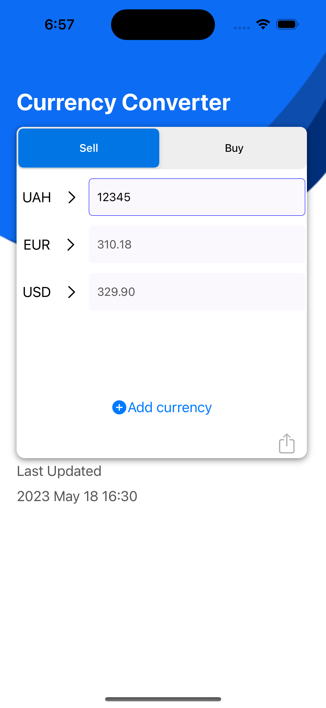
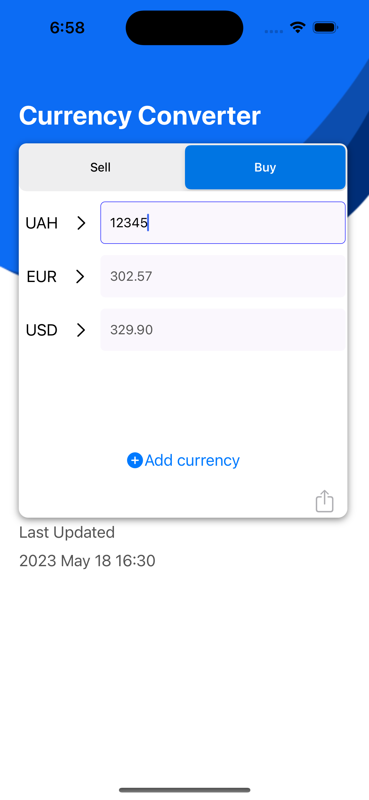

# Currency Converter
-----------------------------------------------------

 
 
 

- [Currency Converter](#currency-converter)
  - [Completion Requirements](#completion-requirements)
    - [Application](#application)
    - [Required Functionality](#required-functionality)
  - [Stack](#stack)
  - [Additions & Explanations](#additions--explanations)
  - [Installation and Usage](#installation-and-usage)
  - [License](#license)

This is a currency converter application that allows users to quickly assess the current exchange rate and perform currency conversions.

## Completion Requirements

### Application

Create an application for quick assessment of the current exchange rate.

### Required Functionality

- Add an input field for evaluating the sale/purchase of selected foreign currency by the user.
- The layout of the application should be adapted for different devices (iPhone/iPad) and orientations (portrait/landscape).
- Display the buy/sell rate relative to 2-3 major foreign currencies in the country, with the country's currency as the first option.
- Provide offline functionality.
- Update the exchange rate no more than once an hour.
- Add the ability to share the exchange rate of the selected currency to the country currency in messengers and more.
- Minimum iOS 14.

## Stack

- Swift
- UIKit
- Storyboard
- Auto Layout
- Trait collections
- URLSession
- Codable
- Repository pattern
- Third-party API
- MVC
- Design instruments: Figma

## Additions & Explanations

- Use any free public APIs to get the exchange rate, for example: [https://api.privatbank.ua/#p24/exchange](https://api.privatbank.ua/#p24/exchange)
- Design: [Figma - Currency Converter](https://www.figma.com/file/yt2U4Dg7FNMzmNf3ZVlgJm/Currency-converter)
- Use elements from the "Text fields" task.
- Hint: For example, if the exchange rate was updated at 8:24, then the next update from the network should only be requested after 9:00. If the update fails, display the update time.
- Write tests for the application.
  - Unit testing bundle.
  - UI testing bundle.

## Installation and Usage

1. Clone the repository.
2. Open the project in Xcode.
3. Build and run the application on your iOS device or simulator.
4. Use the input field to evaluate the sale/purchase of selected foreign currency.
5. View the buy/sell rate relative to major foreign currencies.
6. Share the exchange rate of the selected currency to the country currency in messengers and more.

## License

Feel free to contribute and make the currency converter application even better!
